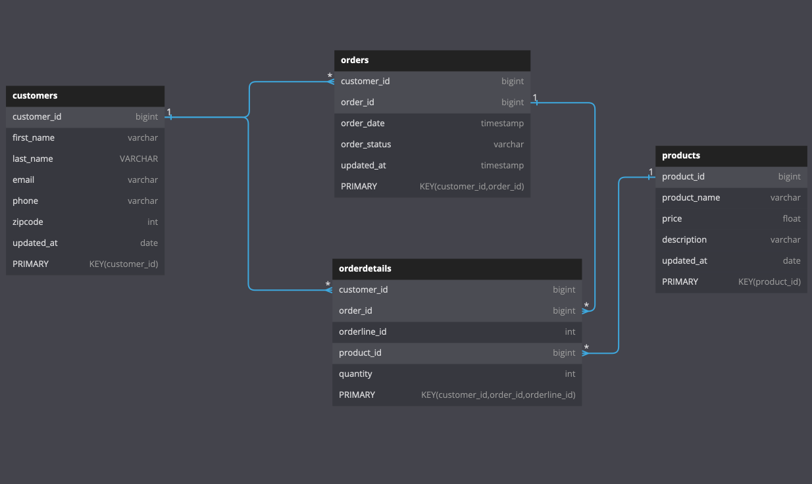
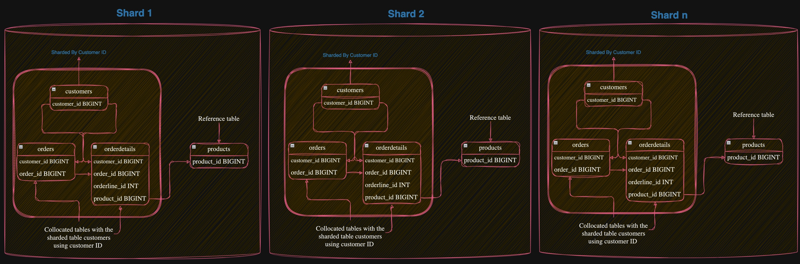

# Limitless E-Commerce sample schema

## Diagram:

Standard tables:


Limitless tables:


## Prerequisites:

1. User must first create an Amazon Aurora cluster and Limitless Database shard group. The steps to do so are outlined in the relevant documentation.
2. User should ensure they have the psql client installed on their local machine or EC2 instance, which will allow them to connect to the Aurora Limitless Database shard group.

Before running any script, set the following environment variables and then use psql to connect to the postgres_limitless database:

```
export PGHOST=<Aurora Limitless endpoint>
export PGPORT=<Port>
export PGUSER=<User Name>
export PGPASSWORD=<Password>
export PGDATABASE=postgres_limitless
psql
```

The Limitless endpoint will load balance the connections between the routers using Amazon Route 53. However, Route 53 has limited capabilities in load balancing, which can result in uneven workloads on the transaction routers.

To overcome this issue when using pgbench, the user must utilize the PGLOADBALANCEHOSTS feature by using the psql client version 16.

To set the environment variables and automatically set the PGHOST environment variable to all router endpoints, using random load balancing, the following can be used:

```
export PGHOST=<Aurora Limitless endpoint>
export PGPORT=<Port>
export PGUSER=<User Name>
export PGPASSWORD=<Password>
export PGDATABASE=postgres_limitless

export PGHOST=$(psql --no-psqlrc -tAc "select ROUTER_ENDPOINT from aurora_limitless_router_endpoints()" | paste -sd,)
echo $PGHOST
export PGLOADBALANCEHOSTS=random
export PGCONNECT_TIMEOUT=60 
psql

```


## Create Limitless E-Commerce sample schema (ec_sample):

The steps outlined below will create Limitless E-Commerce sample schema and generate sample data consisting of 10 million customers, 1 million products, 100 million orders, and 200 million order details. 

The steps outlined can be modified to generate sample data of varying sizes, as required. The specific volume of customers, products, orders, and order details can be adjusted

1- Create E-Commerce sample schema's standard tables 

```
\i create_standard_tables_ec_sample_schema.sql
```

2- Convert E-Commerce sample schema's standard tables to limitless tables

Convert customers table to sharded table using `customer_id` shard key.

Convert orders and  orderdetails tables to collocated tables using `customer_id`.

Convert products table to a reference table.

```
\i convert_standard_tables_to_limitless_ec_sample_schema.sql
```

3- Create E-Commerce sample schema's SEQUENCEs and FUNCTIONs That will be used to generate the sample data for customer and product tables

Before creating the sequences, the `rds_aurora.limitless_sequence_chunk_size` parameter needs to be set to 10 million. This will set the size of the chunk allocated for each sequence on the current router at the session level. This is necessary to ensure that there are no gaps in the `customer_id` and `product_id` values for products and customers tables, as the sample data will be generated from a single router.

adjust `rds_aurora.limitless_sequence_chunk_size` to higher or lower value based on the maximum number of rows for customer and product tables.

```
set  rds_aurora.limitless_sequence_chunk_size=10000000;
show rds_aurora.limitless_sequence_chunk_size;
\i create_sequences_functions_ec_sample_schema.sql
```


4- Generate 10 million customer and 1 million product

It is possible to generate more or less sample data for customer and product tables by modifying the value of the 'X' parameter in the `generate_series(1, X)` function call within the script.

```
\i generate_sample_data_10M_customer_1M_product_ec_sample_schema.sql
```


5- Load data into the orders and orderdetails tables using pgbench

`insert_orders_orderdetails_ec_sample_schema.sql` script will be used in conjunction with [pgbench](https://www.postgresql.org/docs/current/pgbench.html), This script has been specifically designed to work with pgbench.


5.1 In below example pgbench will insert only 100 million orders and 200 million orderdetails ( --client=500 * --transactions=200000 = 100 million).

```
pgbench  -n --client=500 --jobs=100 --progress=60 --transactions=200000  -f insert_orders_orderdetails_ec_sample_schema.sql 
```

5.2 In below example pgbench will open 512 connection and will run for 900 sec and it will insert the rows as fast as possible.

```
pgbench  -n --client=512 --jobs=100 --progress=60 --time=900 -f insert_orders_orderdetails_ec_sample_schema.sql 
```


Notes:

* You may need to adjust the script insert_orders_orderdetails_ec_sample_schema.sql if you changed the number of customers or products in the previous step,the instruction is available inside the script. 


* The "--jobs=threads" option specifies the number of worker threads within pgbench. Utilizing more than one thread can be beneficial on multi-CPU systems, as the clients will be distributed as evenly as possible among the available threads. The default value for this option is 1.

The use of the "--jobs=100" option will cause pgbench to open connections more rapidly, and the clients will be distributed as evenly as possible among the available threads.


* Increase the sequence cache for the `order_id` sequence, if you observe an increase in the LWLock:BufferContent wait event for the query `select nextval('ec_sample.order_id_seq')` 

```
alter sequence ec_sample.order_id_seq cache 100;
```


## Use UUID instead of Sequence in the E-Commerce Sample Schema:

Use UUID instead of sequence of numbers for `order_id` column in the orders and orderdetails tables.

1- Install the uuid-ossp extension

```
CREATE EXTENSION IF NOT EXISTS "uuid-ossp";
```

2- Create E-Commerce sample schema's standard tables 

```
\i create_standard_tables_ec_sample_schema_uuid.sql
```

3- Convert E-Commerce sample schema's standard tables to limitless tables

```
\i convert_standard_tables_to_limitless_ec_sample_schema.sql
```


4- Create E-Commerce sample schema's SEQUENCEs and FUNCTIONs That will be used to generate the sample data for customer and product tables

Before creating the sequences, the `rds_aurora.limitless_sequence_chunk_size` parameter needs to be set to 10 million. This will set the size of the chunk allocated for each sequence on the current router at the session level. This is necessary to ensure that there are no gaps in the `customer_id` and `product_id` values for products and customers tables, as the sample data will be generated from a single router.

adjust `rds_aurora.limitless_sequence_chunk_size` to higher or lower value based on the maximum number of rows for customer and product tables.

```
set  rds_aurora.limitless_sequence_chunk_size=10000000;
show rds_aurora.limitless_sequence_chunk_size;
\i create_sequences_functions_ec_sample_schema.sql
```


5- Generate 10 million customer 1 million product

It is possible to generate more or less sample data for customer and product tables by modifying the value of the 'X' parameter in the `generate_series(1, X)` function call within the script.

```
\i generate_sample_data_10M_customer_1M_product_ec_sample_schema.sql
```

6- Load data into the orders and orderdetails tables using pgbench

`insert_orders_orderdetails_ec_sample_schema_uuid.sql` script will be used in conjunction with [pgbench](https://www.postgresql.org/docs/current/pgbench.html), This script has been specifically designed to work with pgbench.


6.1 In below example pgbench will insert only 100 million orders and 200 million orderdetails ( --client=500 * --transactions=200000 = 100 million ).

```
pgbench  -n --client=500 --jobs=100 --progress=60 --transactions=200000  -f insert_orders_orderdetails_ec_sample_schema_uuid.sql 
```

6.2 In below example pgbench will open 512 connection and will run for 900 sec and it will insert rows as fast as possible.

```
pgbench  -n --client=512 --jobs=100 --progress=60 --time=900 -f insert_orders_orderdetails_ec_sample_schema_uuid.sql 
```

## Uninstallation:


To drop the `ec_sample` schema and all its objects.

```
\i drop_ec_sample_schema.sql
```


